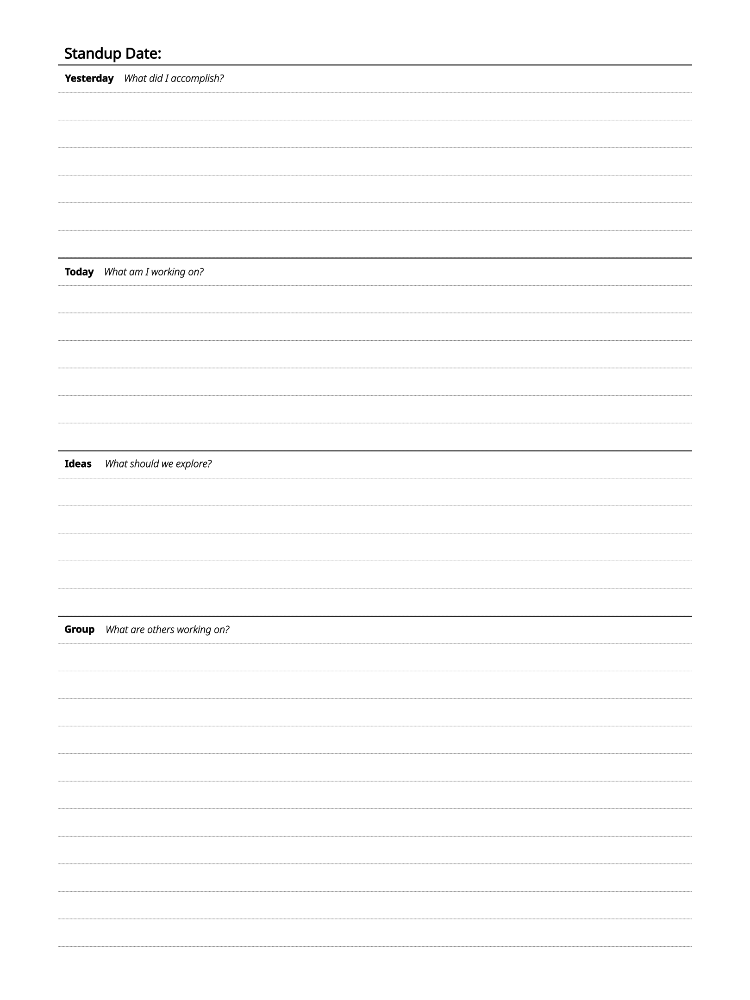

# reMarkable Templates
Various custom reMarkable templates.

## Installation
Refer to this [installation guide](https://www.simplykyra.com/blog/how-to-upload-custom-templates-to-your-remarkable-2025-update/).

## Adding Templates
Templates are created here using Inkscape. Here are the settings used for each platform:

| Platform | Canvas Size | Export DPI |
|----------|-------------|------------|
| Paper Pro | 1620 x 2160 | 96 |

---

## Template Directory
Templates are organized into categories. Click on the image of the template to quickly link to it.

### Meetings

#### Software Standup
This template is a good fit for daily software standup meetings. It was inspired by the reMarkable Methods Stand-up template.

##### Paper Pro

## License
This project is licensed under the [GNU General Public License v3.0](LICENSE).

## Contribution
Contributions are welcome! To add a new template:

1. Create the template in Inkscape using the canvas size and DPI from the platform table above.
2. Save the source SVG to `src/<platform>/<category>/<template_name>.svg`.
3. Export a PNG render to `renders/<platform>/<category>/<template_name>.png`.
4. Add an entry to the Template Directory in this README.
5. Submit a pull request.
